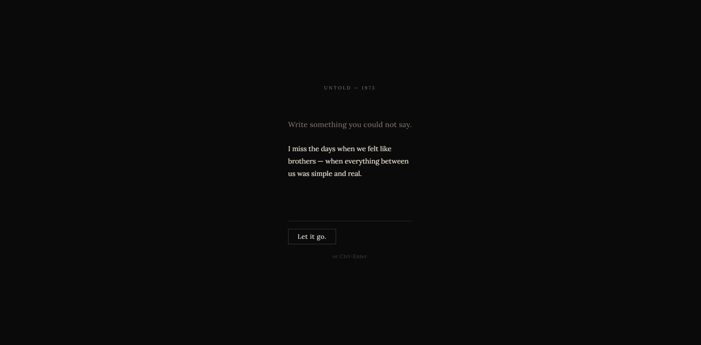
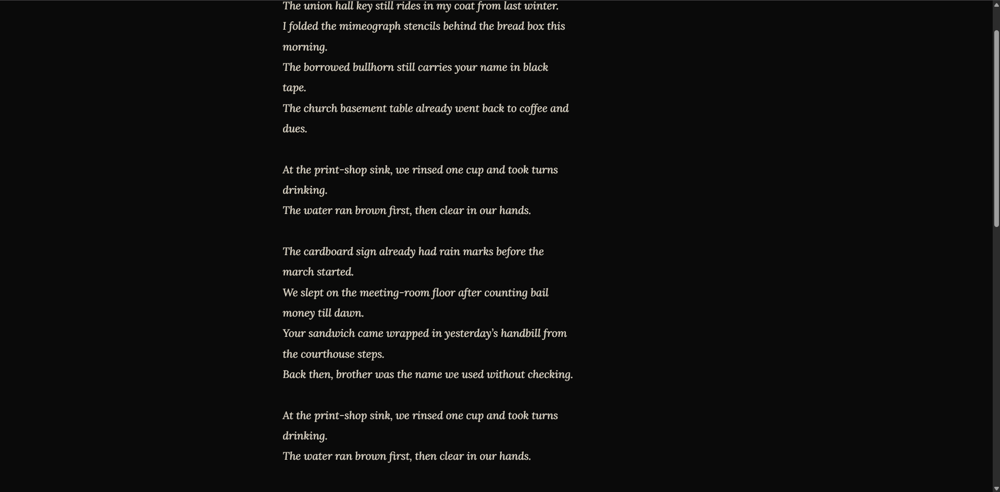
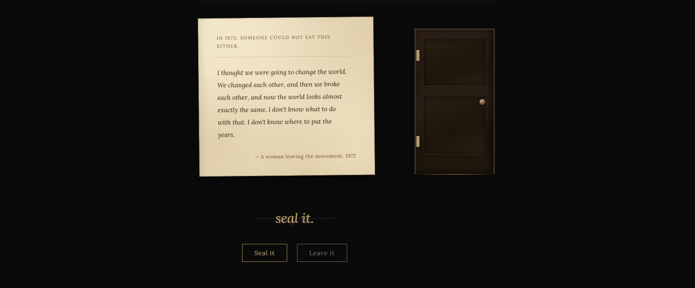

> _"Everyone knocks on heaven's door in their own way."_

An interactive web experience that transforms unspoken emotions into original lyrics in the spirit of Bob Dylan's 1973 — grounded in a curated archive of unsent letters from the Vietnam era and the counterculture.

---

## Artistic Statement

Untold is not a chatbot. It is a witness.

You write the thing you could never say. The system searches decades of unsent letters — Vietnam veterans who never called home, lovers who mailed nothing, children who swallowed their pride — and finds the one that resonates. Then it writes the lyric that the moment deserves.

The door appears. It knocks. You decide what to do with it.

The project is built around the emotional core of Dylan's "Knockin' on Heaven's Door" (1973): the act of putting down the thing you can no longer carry. Not grief alone — but the weight of the word that was never handed over. Seal it. Send it. Or leave it behind.

---

## AI Techniques

Two distinct AI paradigms interweave to produce each result. Neither alone produces the output.

| Technique | Model | Role |

|---|---|---|

| Semantic Embedding + Cosine Similarity | `text-embedding-3-small` | Archive retrieval via vector similarity (pure math — no LLM) |

| Content Moderation | `gpt-4o-mini` | Guardian: blocks inappropriate input before the pipeline starts |

| NLP Theme Interpretation | `gpt-4o-mini` | Classifies unspoken emotion → valence, time orientation, relational direction |

| Match Evaluation | `gpt-4o-mini` | Scores archive candidates (1–10) across 3 emotional axes; retries if score < 7 |

| LLM Lyric Generation | `gpt-5.5` (T=0.82) | Writes the lyric, streaming token-by-token via SSE |

**How they interweave:** The embedding retrieval determines _which_ historical fragment enters the generation context. The LLM's output is causally dependent on the vector math — a different cosine match produces a fundamentally different lyric. Change the embedding model or the archive, and every lyric changes. The techniques are structurally coupled, not layered independently.

### HyDE — Hypothetical Document Embeddings

Standard RAG embeds raw text and compares it against the user's query. This produces poor results when the query and corpus live in different registers.

Untold uses **HyDE**: every archive entry is embedded not as its raw text, but as a _1973 archivist annotation_ — a three-sentence librarian-style description of what was left unsaid, to whom, and whether the chance still exists. User input is _also_ converted to an archivist annotation before embedding.

This creates a symmetric semantic space: query and corpus speak the same language. The cosine similarity measures emotional geometry, not surface vocabulary.

---

## Architecture

```

User Input

    │

    ▼

Guardian ─────────────── gpt-4o-mini (max_tokens=5)

    │                    Returns BLOCKED → "say it nicer." + reset

    │ OK

    ▼

Theme Interpreter ──────► gpt-4o-mini

    │                      Extracts: valence, time_orientation,

    │                      relational_direction, search_query

    │                      (search_query written as 1973 archivist annotation)

    ▼

Semantic Search ─────────► text-embedding-3-small

    │                       Embeds search_query

    │                       Cosine similarity over pre-embedded archive

    │                       Returns top-5 candidates

    ▼

Evaluator ───────────────► gpt-4o-mini

    │                       Scores top candidate (1–10) on 3 axes:

    │                       emotional valence, time orientation, relational match

    │                       Retries with next candidate if score < 7

    ▼

Lyric Generator ─────────► gpt-5.5 (T=0.82)

    │                       Streams tokens via SSE

    │                       Style: Dylan 1973, plain speech, 10–15 words/line

    │                       3 verses × 4 lines + 2-line refrain (repeated)

    ▼

Frontend State Machine (13 states)

    └── waiting → fetching → lyric_revealing → archive_visible

        → door_visible → knocking → options → sealing → sealed

        → sending → sent → leaving → gone

```

### Frontend State Machine

The Angular 21 frontend is driven by a single reactive signal (`state`) with 13 named states. Each state controls which layers render and which animations play.

```

waiting         Input screen — user types the unsaid thing

fetching        "while you still have the chance / say it. / seal it."

lyric_revealing Lyric streams in line by line + search theater below

archive_visible Archive echo (matched historical letter) appears

door_visible    3D wooden door materializes beside the archive

knocking        Door shudders (CSS 3D) + synthesized knock audio (Web Audio API)

options         "Seal it." / "Leave it." choice presented

sealing         Wax seal animation plays over the lyrics

sealed          "Send it." button appears over sealed envelope

sending         Door opens (CSS 3D hinge) + envelope flies through doorway

sent            "The letter has left." + begin again

leaving         Leaving fade — the door closes

gone            "The door is closed." + begin again

```

---

## Project Structure

```

untold/

├── backend/

│   ├── app/

│   │   ├── config.py           # Model names, temperature, thresholds

│   │   ├── main.py             # FastAPI app, CORS, lifespan

│   │   ├── routes.py           # POST /api/transform, POST /api/transform/stream

│   │   ├── guardian.py         # Content moderation gate

│   │   ├── theme_interpreter.py# Emotion classification → search_query

│   │   ├── matcher.py          # Cosine similarity retrieval over archive

│   │   ├── evaluator.py        # Match scoring + retry logic

│   │   ├── transformer.py      # Lyric generation (sync + async/stream)

│   │   ├── prompts.py          # SYSTEM_PROMPT (Dylan 1973 style guide)

│   │   ├── schemas.py          # Pydantic models (TransformRequest, ArchiveMatch, …)

│   │   ├── audio_selector.py   # Maps archive source_type → ambient track

│   │   └── logging_config.py   # Structured JSON logging

│   ├── data/

│   │   ├── archive.json              # 37 raw archive entries

│   │   ├── archive_annotated.json    # Archive with archivist annotations (HyDE)

│   │   └── archive_embeddings.npz    # Pre-computed embedding vectors

│   ├── requirements.txt

│   └── .env

│

└── frontend/

    └── src/app/

        ├── app.ts              # Root component — 13-state machine, signal graph

        ├── app.html            # Template — conditional rendering per state

        ├── app.scss            # Layout, animation keyframes

        ├── services/

        │   ├── transform.service.ts      # SSE client, stream parsing

        │   ├── audio.service.ts          # Web Audio API door knock synthesis

        │   └── envelope-export.service.ts# Canvas → WebM video export

        └── components/

            ├── input-panel/        # Textarea + submit

            ├── lyric-stream/       # Token-by-token reveal

            ├── archive-echo/       # Historical letter display

            ├── search-theater/     # Live archive search animation

            ├── door-scene/         # CSS 3D perspective door

            ├── options-panel/      # Seal it / Leave it

            ├── envelope-scene/     # Wax seal animation

            └── envelope-flight/    # Envelope → door flythrough

```

---

## Installation

### Requirements

- Python 3.11+

- Node.js 18+

- OpenAI API key (with access to `gpt-5.5` and `text-embedding-3-small`)

### Backend

```bash

cd backend


# Copy and fill in your API key

cp .env.example .env


# Install dependencies

pip install -r requirements.txt


# Build archive embeddings (first run only — takes ~30 seconds)

python -m app.build_annotations   # Generates archive_annotated.json

python -m app.build_embeddings    # Generates archive_embeddings.npz


# Start the server

uvicorn app.main:app --reload --port 8000

```

### Frontend

```bash

cd frontend

npm install

npm start          # http://localhost:4200

```

### Environment Variables

| Variable | Required | Description |

|---|---|---|

| `OPENAI_API_KEY` | Yes | OpenAI API key |

| `ALLOWED_ORIGINS` | No | Comma-separated CORS origins. Default: `http://localhost:4200` |

`.env` file example:

```env

OPENAI_API_KEY=sk-...

```

---

## API

### `POST /api/transform/stream`

Main endpoint. Accepts a user's unspoken text and streams the result as Server-Sent Events.

**Request:**

```json
{ "user_text": "I never told my father I was proud of him." }
```

**SSE Event stream:**

| Event type | Payload | Description |

|---|---|---|

| `blocked` | — | Guardian blocked the input |

| `matches` | `{ matches: [...], ambient_track: "..." }` | Archive match resolved |

| `token` | `{ text: "..." }` | Lyric token (streamed) |

| `done` | — | Generation complete |

| `error` | — | Pipeline failure |

### `POST /api/transform`

Non-streaming version. Returns the complete lyric and match in a single response.

**Response:**

```json
{
  "lyric": "...",

  "matches": [
    {
      "id": "...",
      "text": "...",
      "context": "...",
      "year": 1971,
      "similarity": 0.87
    }
  ],

  "ambient_track": "vietnam_letter",

  "evaluator_metadata": { "final_score": 8, "retried": false }
}
```

---

## Dependencies

**Backend**

| Package | Version | Purpose |

|---|---|---|

| FastAPI | 0.115.0 | HTTP framework + SSE |

| Uvicorn | 0.32.0 | ASGI server |

| OpenAI SDK | ≥ 1.57.0 | Embeddings + chat completions |

| NumPy | ≥ 2.1.0 | Cosine similarity computation |

| Pydantic | 2.9.2 | Request/response validation |

| python-dotenv | 1.0.1 | Environment variable loading |

**Frontend**

| Package | Version | Purpose |

|---|---|---|

| Angular | 21.1 | Component framework, signals |

| TypeScript | 5.9 | Type safety |

| RxJS | 7.8 | Observable streams |

---

## Historical Archive

The archive contains 37 curated entries spanning 1968–1995, organized across three source types:

| Source type | Period | Description |

|---|---|---|

| `vietnam_letter` | 1968–1975 | Unsent correspondence from soldiers and their families |

| `counterculture` | 1967–1972 | Anti-war movement writers; letters never mailed |

| `dylan_era_reflection` | 1973–1995 | Notes and fragments from the Pat Garrett era onward |

All entries are **curated fictions grounded in documented historical voices** — composites that carry the emotional truth of the period, not transcriptions of real letters. They are embedded via archivist annotations (HyDE), not raw text, ensuring the retrieval space is defined by emotional geometry rather than vocabulary overlap.

---

## Content Safety

Untold accepts deeply personal input from users and generates output in a public or semi-public exhibition context. Two independent safety layers protect both the user and the artwork.

### Layer 1 — Input Length Validation (Pydantic)

The `user_text` field is validated at the schema level before any AI call is made:

```python

user_text: str = Field(..., min_length=1, max_length=2000)

```

Empty submissions and text over 2,000 characters are rejected with a 422 before reaching the pipeline.

### Layer 2 — LLM Content Guardian

The first stage of every pipeline request is a dedicated moderation check (`guardian.py`) that runs before the theme interpreter, before the archive search, and before any lyric generation.

```

User Input → Guardian → (pipeline continues) or → BLOCKED

```

The guardian uses `gpt-4o-mini` with `temperature=0` and `max_tokens=5` — it cannot generate anything, only classify. Its system prompt instructs it to detect:

- Profanity and slurs

- Hate speech

- Explicit sexual content

- Graphic violence

- Seriously offensive language **in any language** — including Turkish, English, and others

The model returns exactly one word: `BLOCKED` or `OK`. Anything other than `BLOCKED` is treated as `OK` — the check fails safe toward permissiveness.

**On block:** The SSE stream immediately emits `{"type": "blocked"}` and closes. The frontend intercepts this event, displays _"say it nicer."_ in place of the normal error, and resets the state machine to `waiting` — returning the user to the input screen without advancing the pipeline at all.

```

blocked event → error.set("say it nicer.") → state.set("waiting")

```

No archive query is made, no embedding is computed, no lyric is generated, and no content from the inappropriate input enters any model context beyond the guardian itself.

### Why a separate guardian instead of relying on OpenAI's built-in moderation?

OpenAI's moderation endpoint is English-centric and misses multilingual profanity. Using a chat model with an explicit multilingual instruction catches Turkish, French, and other language inputs that the default moderation endpoint regularly passes.

---

## Design Notes

**Why streaming?** The lyric appears line by line as it is generated, not as a block dump. This mirrors how a song reveals itself — you hear each line before the next arrives. Server-Sent Events (SSE) allow true token-level streaming without WebSocket overhead.

**Why 0.82 temperature?** Lower values (≤ 0.7) produce metrically predictable lyrics that start sounding like templates. Higher values (≥ 0.95) break line discipline. 0.82 preserves the structural rules (line length, no similes, no banned words) while leaving enough entropy for genuinely different outputs on identical inputs.

**Why HyDE?** Direct embedding of raw archive text against a user's plain-language input fails because the two registers are too different. A user writes "I couldn't say goodbye." An archive entry reads "Mekong Delta, October 1969." Standard cosine similarity finds vocabulary overlap; HyDE finds emotional overlap.

**Why an evaluator with retry?** The top cosine similarity hit is not always the best emotional match — it is the closest vector, which may be a surface coincidence. The evaluator scores emotional valence, time orientation (past irreversible vs. present still possible), and relational direction (parent, lover, self). One retry against the next candidate catches the cases where the top hit is geometrically close but emotionally wrong.

---

## ScreenShots









---

## Artist's Manifesto

→ [MANIFESTO.md](MANIFESTO.md)

---

## Course Context

**CSE 358 — Introduction to Artificial Intelligence**

Assignment: _KNOCK: Design Your Door_

The brief required an interactive AI artwork engaging with a cultural or historical context using at least two distinct AI techniques. Untold uses semantic vector retrieval and a multi-stage language model pipeline as distinct, structurally coupled techniques — reflecting the RAG paradigm described in the assignment rubric.

The historical context is not decorative. The archive's 37 entries are the retrieval corpus. The embedding vectors are derived from Vietnam-era emotional material. The pipeline cannot produce a lyric without passing through that history first.
